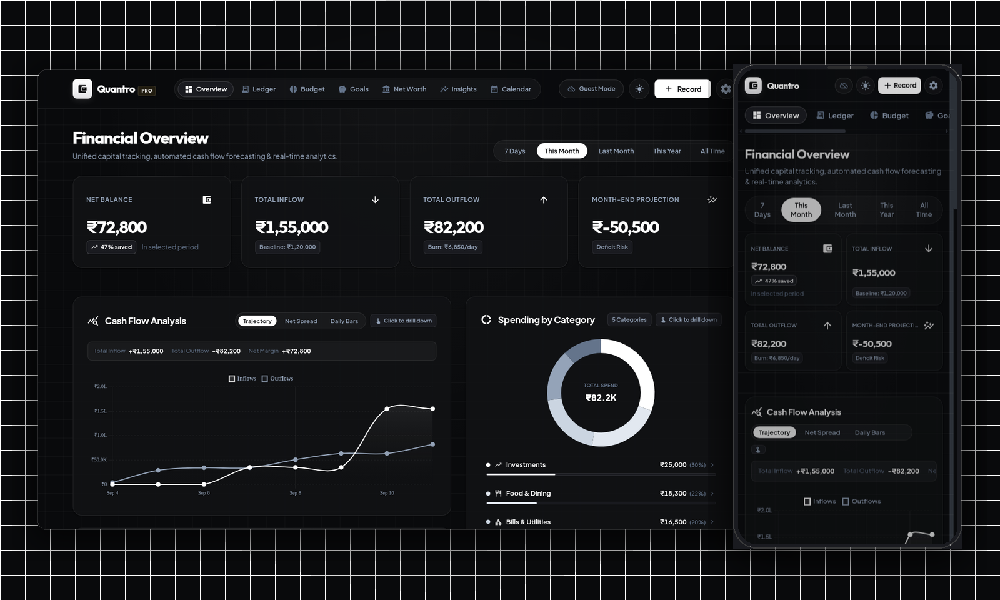

# Quantro - Smart Finance Manager

Quantro is a private, local-first personal finance platform featuring an Android application and a responsive web client. It provides real-time income and expense tracking, automated SMS transaction detection, category budget limits, net worth calculation, and savings goals without cloud dependencies.



## Download & Releases

### Android Application
Download the latest pre-compiled universal APK from GitHub Releases:
- **Latest Release:** [Quantro v1.0.1](https://github.com/suraj-yadav0/money_manager/releases/tag/v1.0.1)
- **Direct APK Download:** [quantro-v1.0.1.apk](https://github.com/suraj-yadav0/money_manager/releases/download/v1.0.1/quantro-v1.0.1.apk)

Compatible with Android 8.0+ (ARM64, ARMv7, x86_64).

---

## Core Features

- **Automated SMS Parsing:** Instantly captures debit and credit alerts from bank SMS notifications without manual entry.
- **Local-First Privacy:** All financial records are stored locally on your device in an embedded SQLite database using Drift ORM.
- **Visual Analytics:** Interactive category spending donut charts, daily spend velocity, and cash flow trajectory.
- **Budget Pacing:** Monthly category budget limits with pacing warnings and progress tracks.
- **Net Worth Tracking:** Asset and liability ledger with capital solvency ratio and timeline snapshots.
- **Savings Goals:** Multi-stage goal tracking with milestone deadlines and linked contribution transactions.
- **Responsive Web Client:** Standalone single-tone web application (`web_app/`) with support for local LAN hosting, private local mode, and custom Firebase sync.
- **Biometric Security:** Optional fingerprint and Face ID authentication via local hardware.

---

## Tech Stack

| Component | Technology | Description |
|---|---|---|
| Mobile Framework | Flutter (Dart 3) | Cross-platform client for Android, iOS, Desktop |
| State Management | Flutter Riverpod | Reactive state and data caching |
| Database | SQLite via Drift | Type-safe local database with migrations |
| Web Application | Vanilla JS + Vite | Responsive single-tone web client |
| Web Charts | Chart.js | Interactive donut, bar, and trajectory visualizations |
| Containerization | Docker + Nginx | Production multi-stage build for local network self-hosting |

---

## Quick Start

### 1. Mobile Application (Flutter)

#### Prerequisites
- Flutter SDK >= 3.24.0
- Android SDK (for Android builds) or Xcode (for macOS/iOS)

#### Setup & Run
```bash
# Clone the repository
git clone https://github.com/suraj-yadav0/money_manager.git
cd money_manager

# Install dependencies
flutter pub get

# Generate Drift database and Riverpod models
dart run build_runner build --delete-conflicting-outputs

# Run on a connected Android device or emulator
flutter run -d android
```

#### Build Release APK
```bash
flutter build apk --release
# Output: build/app/outputs/flutter-apk/app-release.apk
```

---

### 2. Web Application (`web_app`)

The web client runs independently and can be hosted locally on your network for family or desktop access.

#### Development Server
```bash
cd web_app
npm install
npm run dev
# Accessible at http://localhost:5173
```

#### Production Build & Host
```bash
npm run build
npm run host
# Accessible across LAN at http://<host-ip>:5173
```

#### Docker Self-Hosting (Recommended for Home Servers)
From the repository root:
```bash
docker compose up -d --build
# Accessible at http://localhost:8080
```

---

## Testing & Quality

### Run Flutter Test Suite
```bash
flutter test
```

### Static Analysis
```bash
flutter analyze
```

### Web Build Validation
```bash
cd web_app
npm run build
```

---

## Project Structure

```
money_manager/
├── lib/
│   ├── main.dart                  # Mobile app entry point
│   ├── core/                      # Shared theme, database, navigation, and utilities
│   │   ├── database/              # Drift schema definitions and queries
│   │   ├── navigation/            # Shell and routing navigation
│   │   └── theme/                 # Design tokens and styling
│   └── features/                  # Feature-driven modules
│       ├── dashboard/             # Cash flow and overview screens
│       ├── transactions/          # Transaction ledger and SMS categorization
│       ├── budget/                # Category caps and budget tracking
│       ├── goals/                 # Savings milestones and contributions
│       └── networth/              # Asset/liability holdings and solvency
├── web_app/                       # Responsive web client (Vite, JS, CSS)
│   ├── src/
│   │   ├── pages/                 # Web page views (Dashboard, Ledger, Budget, Net Worth)
│   │   └── css/                   # Responsive styling and design system
│   └── Dockerfile                 # Multi-stage production Nginx container
├── test/                          # Unit and integration test suites
└── docker-compose.yml             # Self-hosting Docker composition
```

---

## Contributing

1. Fork the repository and create a feature branch (`git checkout -b feature/improvement`).
2. Make your modifications and verify all tests pass (`flutter test` and `npm run build`).
3. Commit your changes with clear, concise messages.
4. Submit a pull request to `main`.

---

## License

This project is licensed under the MIT License.
